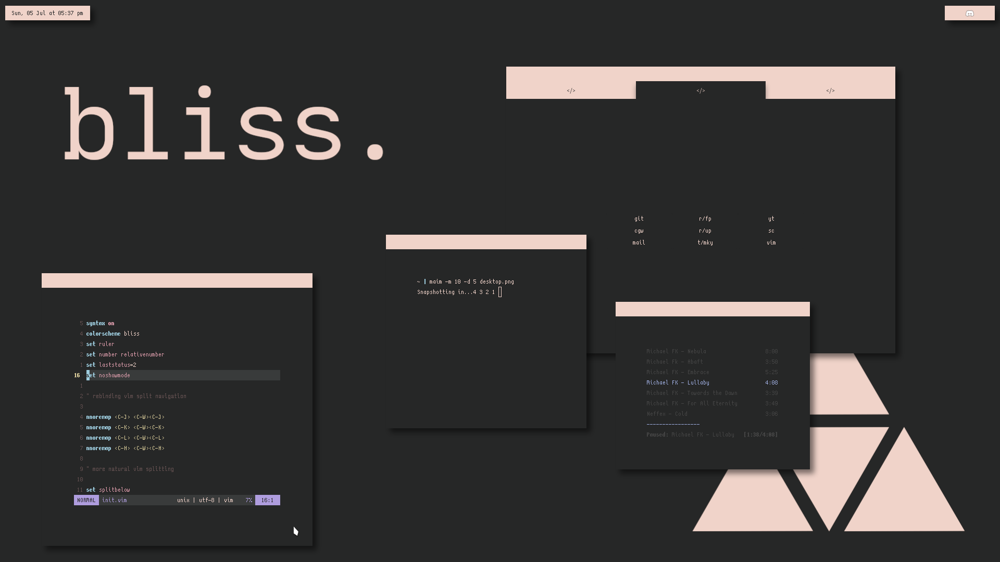
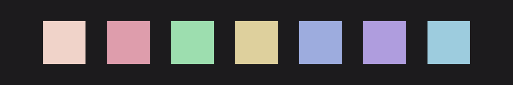
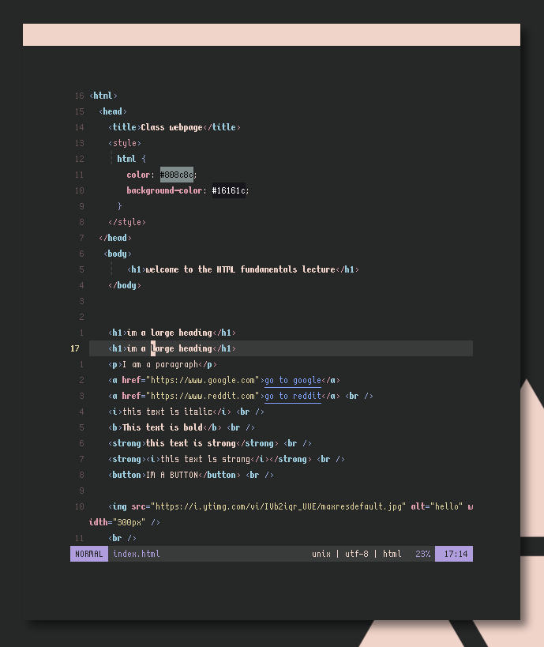
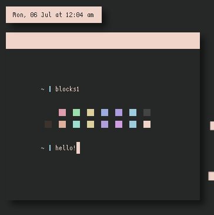
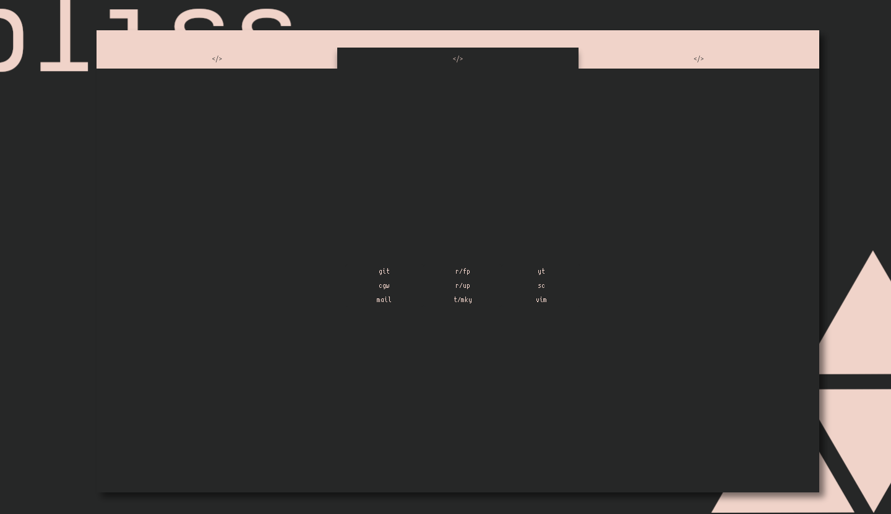
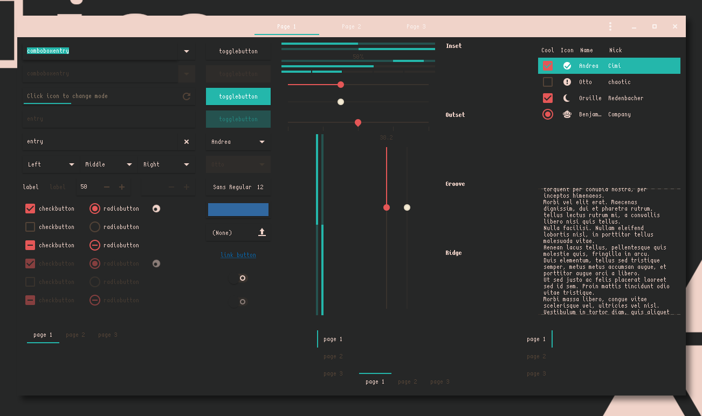
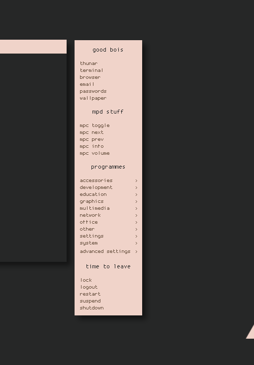

<h1 align="center">An easy-on-the-eyes, all purpose colorscheme for the poweruser.</h1>
<h3 align="center">Inspired by the <a href="https://dixiemech.com/sabliss">SA Bliss</a> keycap set.

***

***

<h3 align="center">Vim Colorscheme.</h3>

<h4 align=center>Dark base with soft contrast for hours of painless work.</h4>

***

<h3 align="center">Alacritty and .Xresources Colorscheme.</h3>

<h4 align="center">Use your terminal(s) in style, full color palette with no conflicts.</h4>

***

<h3 align="center">Firefox Userchrome.</h3>
<h5 align="center">Credit goes 100% to <a href="https://github.com/GaugeK/polka">GaugeK</a>.</h5>

<h4 align="center">Ultra minimalist by design, yet full functionality can be achieved with [ALT] and [F6] keys, and even further with add-ons like Vimium C.</h4>

***

<h3 align="center">GTK+ and Openbox Theme.</h3>
<h5 align="center">I would never forget to incude these.</a></h5>

